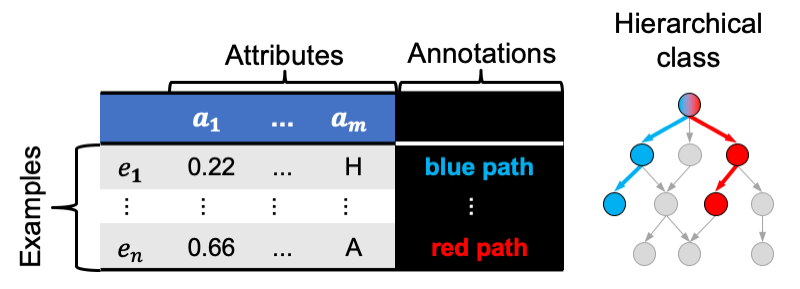

# Hierarchy decomposition pipeline

Hierarchy decomposition pipeline is a supervised machine learning tool that constructs random forest ensembles from data sets with hierarchical class.



Suitable data sets have:
- Class labels organised in a hierarchy
- Hierarchy in the shape of a tree or directed acyclic graph
- Examples annotated with one or several paths from the hierarchy

## Features

- Five algorithms that construct ensemble models from data sets with hierarchical class
- Tool for comparing algorithms' predictive performances in cross-validation
- Tool for predicting paths from the hierarchy that best describe unlabelled examples

```warning
This website is a work in progress. It may contain incomplete information and possibly errors. You can help by reviewing the content and posting your comments and corrections [here](https://github.com/vedranav/hierarchy-decomposition-pipeline/issues).
```
