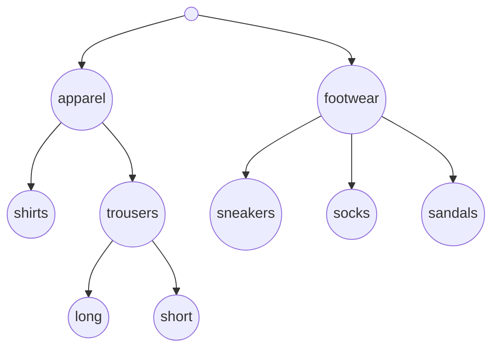

# Data set

The pipeline accepts data sets in a modified version of [ARFF format](https://waikato.github.io/weka-wiki/formats_and_processing/arff_stable/). The format is best illustrated with an example. Suppose that we want to construct a classifier that will categorize products into hierarchically organized categories based on their descriptions. We will address categories as **labels** and their hierarchical organization as **class hierarchy**. Class hierarchy and data set are:

**Class hierarchy:**


**Data set:**
```
@RELATION "product categorization"

@ATTRIBUTE ID string
@ATTRIBUTE feet_related_product {yes, no}
@ATTRIBUTE most_represented_material {cotton, linen, elastane, polyester, leather, rubber, textile, plastic}
@ATTRIBUTE second_most_represented_material {cotton, linen, elastane, polyester, leather, rubber, textile, plastic, none}
@ATTRIBUTE length_cm numeric
@ATTRIBUTE has_sleeves {yes, no}
@ATTRIBUTE CLASS HIERARCHICAL root/apparel, apparel/shirts, apparel/trousers, trousers/long, trousers/short, root/footwear, footwear/sneakers, footwear/socks, footwear/sandals

@DATA
1, yes, rubber, plastic, 28, no, footwear@sandals
2, yes, leather, cotton, ?, no, footwear@sneakers@socks
3, no, cotton, elastane, 77, yes, apparel@shirts
4, no, polyester, elastane, 45, no, apparel@trousers@short
5, no, polyester, elastane, 85, no, apparel@trousers@long
6, no, linen, none, 74, yes, apparel@shirts
```

The data set contains a **header** and **data**. The header describes the data and is followed by the actual data.

## Header

Header begins with @RELATION keyword and name of a data set. Quote the name if it contains spaces.

Next is an ordered sequence of attributes marked by the keyword @ATTRIBUTE. There are three categories of attributes:

1. **Example ID** is a unique identifier of examples defined as @ATTRIBUTE [name] string. Name can be ID or any other that best describes ID of your choice. For example, if examples are genes, you can use their unique identifiers. In case that examples don't have unique IDs, use an iterator. ID attribute is a type of string. It must be the first attribute in a data set.

2. **Attributes that describe properties of examples** are defined as @ATTRIBUTE [name] [type]. Select a name that best describes a property, like has_sleeves. Quote when name contains spaces. An attribute can be one of the two types:
    - **Numeric** - When a property is described with an integer or real number, then use the keyword "numeric". For example, @ATTRIBUTE length_cm numeric.
    - **Nominal** - When a property is described with one of the predefined values, then enumerate the values. For example, @ATTRIBUTE most_represented_material {cotton, linen, elastane, polyester, leather, rubber, textile, plastic}.

3. **Class attribute** contains a class hierarchy defined as @ATTRIBUTE CLASS HIERARCHICAL [class hierarchy]. Class hierarchy is described with parent-child pairs. For example, shirts and trousers are apparel, which is described as "apparel/shirts" and "apparel/trousers". When a parent is a root of hierarchy, then the keyword "root" is used. For example, "root/apparel" and "root/footwear". All pairs from the class hierarchy must be enumerated. Labels in a data set must be unique, composed exclusively of alphanumeric characters. The class attribute must be the last attribute in a data set.

Attribute names must be unique.

## Data

@DATA keyword is followed by examples. Attribute values for each example are delimited by commas. The values must appear in the same order in which they are defined in the header.

Class attribute value is an "at" (@) separated set of labels representing paths associated with an example. For example:

- The product described by the fourth example is categorized as shorts. Class attribute value is apparel@trousers@short.
- The product described by the second example is categorized as a combination of sneakers and socks. The example is labeled with two paths: footwear@sneakers and footwear@socks. Class attribute value is footwear@sneakers@socks.

Each label defined in a header must be represented with at least one example.

Missing attribute values are marked with a question mark (?), e.g., in the second example the value of length_cm attribute is missing. Example ID and class attributes cannot have missing values.

Class attribute value of unannotated examples is "root".

```note
Data set file extension is ".arff". The pipeline also accepts zip compression of an arff file (extension ".arff.zip").
```
