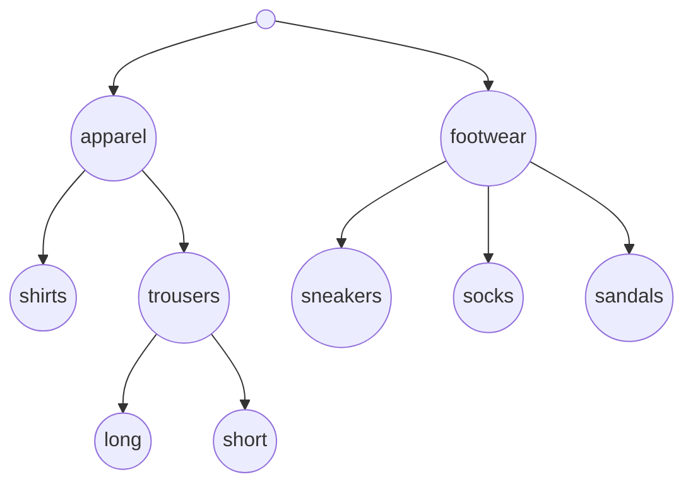

# Data set

The pipeline accepts data sets in **HARFF** format, which stands for **hierarchy-attribute-relation file format**. HARFF is an extension of the [ARFF format](https://waikato.github.io/weka-wiki/formats_and_processing/arff_stable/) that includes hierarchical class. The format is best illustrated with an example. Suppose that we want to construct a classification model that categorizes products into hierarchically organized categories based on their descriptions. We will address categories as **labels** and their hierarchical organization as **class hierarchy**. Class hierarchy and data set are:

**Class hierarchy:**


**Data set:**
```
% Product categorization data set that illustrates HARFF format
% Author: Vedrana Vidulin
@RELATION "product categorization"

@ATTRIBUTE ID string  % This is a unique identifier of examples
@ATTRIBUTE feet_related_product {yes, no}
@ATTRIBUTE most_represented_material {cotton, linen, elastane, polyester, leather, rubber, textile, plastic}
@ATTRIBUTE second_most_represented_material {cotton, linen, elastane, polyester, leather, rubber, textile, plastic, none}
@ATTRIBUTE length_cm numeric
@ATTRIBUTE has_sleeves {yes, no}
@ATTRIBUTE CLASS HIERARCHICAL root/apparel, apparel/shirts, apparel/trousers, trousers/long, trousers/short, root/footwear, footwear/sneakers, footwear/socks, footwear/sandals

@DATA
1, yes, rubber, plastic, 28, no, footwear@sandals
2, yes, leather, cotton, ?, no, footwear@sneakers@socks
3, no, cotton, elastane, 77, yes, apparel@shirts
4, no, polyester, elastane, 45, no, apparel@trousers@short
5, no, polyester, elastane, 85, no, apparel@trousers@long
6, no, linen, none, 74, yes, apparel@shirts
```

The data can be divided in three groups, namely **header**, **data** and **comments**. The header contains metadata. It includes those lines that begin with the at (@) sign. The data follows the header. Comments are marked by the percentage (%) sign.

## Header

Header begins with the @RELATION keyword followed by a name of a data set. Quote the name when it contains spaces.

```
@RELATION "product categorization"
```

Next is an ordered sequence of attributes, each marked by the @ATTRIBUTE keyword. There are three categories of attributes:

- **Example ID** is a unique identifier of examples. It is the first attribute in a data set defined as @ATTRIBUTE [name] string. Name can be ID or any other that best describes ID of your choice. For example, if examples are genes, you can use their unique identifiers. In case that examples don't have unique IDs, use an iterator. ID attribute is a type of "string".

```
    @ATTRIBUTE ID string
```

- **Attributes that describe properties of examples** are defined as @ATTRIBUTE [name] [type]. Select a name that best describes a property, like has_sleeves. Quote when name contains spaces. An attribute can be one of the two types:
    - **Numeric** when a property is represented with an integer or real number. The type is "numeric".
    - **Nominal** when a property can take one of the predefined values. The type enumerates values within curly brackets.

```
        @ATTRIBUTE length_cm numeric

        @ATTRIBUTE most_represented_material {cotton, linen, elastane, polyester, leather, rubber, textile, plastic}
```

- **Class attribute** contains class hierarchy. It is the last attribute in a data set defined as @ATTRIBUTE CLASS HIERARCHICAL [class hierarchy]. Class hierarchy is described with parent-child pairs of labels. For example, shirts and trousers are apparel, which is described as "apparel/shirts" and "apparel/trousers". When a parent is a root of hierarchy, then the keyword "root" is used. For example, "root/apparel" and "root/footwear". All pairs of labels from the class hierarchy must be enumerated. Labels can contain only alphanumeric characters and dots.

```
    @ATTRIBUTE CLASS HIERARCHICAL root/apparel, apparel/shirts, apparel/trousers, trousers/long, trousers/short, root/footwear, footwear/sneakers, footwear/socks, footwear/sandals
```

Header ends with the @DATA keyword.

## Data

Examples are represented as comma delimited attribute values. The values must appear in the same order in which attributes are defined in the header.

Class attribute value is an "at" (@) separated set of labels representing paths associated with an example. For example:

- The product described by the fourth example is categorized as shorts. Class attribute value is apparel@trousers@short.

```
    4, no, polyester, elastane, 45, no, apparel@trousers@short
```

- The product described by the second example is categorized as a combination of sneakers and socks. The example is labeled with two paths: footwear@sneakers and footwear@socks. Class attribute value is footwear@sneakers@socks.

```
    2, yes, leather, cotton, ?, no, footwear@sneakers@socks
```

Note that the label "root" does not appear among the labels associated with examples. It is assumed. Root is explicitly stated only when value of class attribute is not known.

Spaces between @ and the labels will result in error.

Each label defined in a header must be represented with at least one example.

Missing attribute values are marked with a question mark, e.g., in the second example the value of length_cm attribute is missing. Example ID and class attribute cannot have missing values.

## Comments

Comments can be used to describe a data set or a line of interest.

```
@ATTRIBUTE ID string  % This is a unique identifier of examples
```

There are only inline comments. They begin with the percentage (%) sign. Everything in a line after that sign is ignored.


```note
Data set file extension is ".harff". The pipeline also accepts zip compression of an HARFF file with the extension ".harff.zip".
```

```note
The pipeline checks if a data set is in correct format.
```

```note
When the task is to estimate algorithm's performance in cross-validation, the input into the pipeline is a single data set. However, when the task is to annotate new examples, the input are two data sets. Common input for both tasks is a data set with annotated examples, named **baseline data set**. This data set is used to construct a classification model. Product categorization data set is an example of a baseline data set. The second data set, named **unlabelled set**, contains examples for which class attribute value is not known. In practice, this means that all examples in the unlabelled set are associated with root of a class hierarchy. For example, "7, no, linen, none, 72, yes, root". The header of unlabelled set is equal to those of the baseline data set.
```

```warning
Data set format currently does not support tab as a separator. Elements can be separated only by spaces.
```
