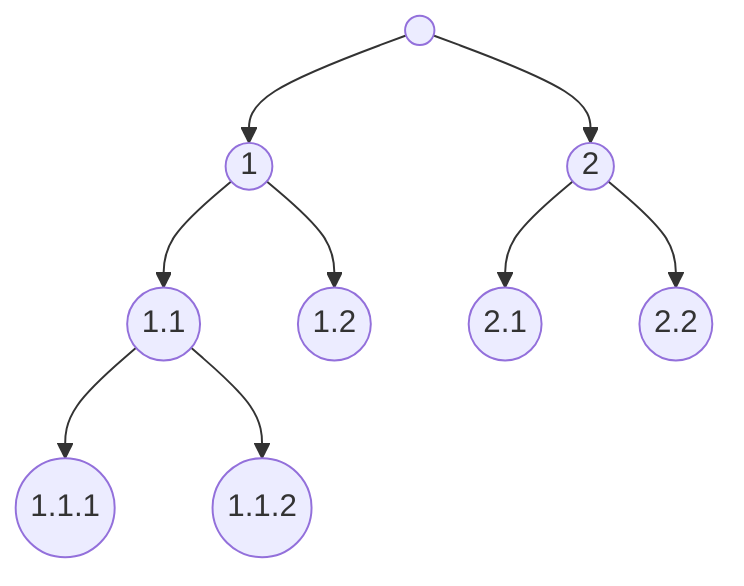

# Repository of data sets with hierarchical class

## General info and files

| Data set | Domain              | Examples | Nominal attributes | Numeric attributes | Source                | File                                              |
| -------- | ------------------- | -------: | -----------------: | -----------------: | --------------------- | ------------------------------------------------- |
| Enron    | text categorization | 1,648    | 1,001              | 0                  | Klimt and Yang, 2004  | [<i class="fa fa-download" aria-hidden="true"></i>](https://github.com/vedranav/hierarchy-decomposition-pipeline/raw/master/src/test/resources/enron.harff.zip) |
| Phyletic profiles | functional genomics | 15,313 | 2,071 | 0 | Vidulin et al., 2016 | [<i class="fa fa-download" aria-hidden="true"></i>](https://github.com/vedranav/hierarchy-decomposition-pipeline/raw/master/src/test/resources/phyletic_profiles.harff.zip) |

Domains:
- **Text categorization** is a problem of automatic annotation of textual documents with one or several categories.
- **Functional genomics** annotates genes with their biological functions.

Data sets:
- **Enron** data set contains bag-of-words descriptions of e-mails from the Enron corporation officials. Hierarchically organized categories define genre, emotional tone and topic.
- **Phyletic profiles** data set contains presence and absence patterns of gene families (clusters of genes that share function) in 2,071 bacterial and archaeal genomes. Gene families are annotated with functions from Gene Ontology.

Data sets are in [HARFF format](https://vedranav.github.io/hierarchy-decomposition-pipeline/inputs/dataset.html), which is a valid input into the pipeline.

## Class hierarchy

| Data set          | Labels | Leaves | Maximal depth | Type | Average forward branching factor | Average backward branching factor |
| ----------------- | -----: | -----: | ------------: | ---- | -------------------------------: | --------------------------------: |
| Enron             | 56     | 52     | 3             | tree | 11.20                            | 1                                 |
| Phyletic profiles | 1,260  | 377    | 14            | DAG  | 2.63                             | 1.85                              |

- **Labels** - The number of labels in class hierarchy
- **Leaves** - The number of leaf labels
- **Maximal depth** - The number of labels on the longest path in class hierarchy (root excluded)
- **Type** - Class hierarchy can be tree-shaped or in the form of directed acyclic graph (DAG). In the former a label can have only one parent, while in the later a label can have multiple parents.
- **Average forward branching factor** - The number of children labels per parent averaged over all parent labels in class hierarchy.
- **Average backward branching factor** - The number of parent labels per child averaged over all children labels in class hierarchy. Backward branching factor is always one for tree-shaped hierarchies, while it is greater than one for DAG hierarchies.

## Annotations

| Data set          | Most specific labels | Cardinality - complete | Cardinality - hierarchical |
| ----------------- | -------------------: | ---------------------: | -------------------------: |
| Enron             | 53                   | 2.87                   | 3.37                       |
| Phyletic profiles | 947                  | 2.59                   | 16.67                      |

Annotation-related data set properties are best explained with an example. Suppose that we have the following class hierarchy:

and a data set composed of five examples annotated in the following manner:

| Example / Label |  1  | 1.1 | 1.1.1 | 1.1.2 | 1.2 |  2  | 2.1 | 2.2 |
| --------------: | :-: | :-: | :---: | :---: | :-: | :-: | :-: | :-: |
| 1               |||||| <i class="fa fa-check"></i> || <i class="fa fa-check"></i> |
| 2               | <i class="fa fa-check"></i> | <i class="fa fa-check"></i> |||||||
| 3               | <i class="fa fa-check"></i> | <i class="fa fa-check"></i> || <i class="fa fa-check"></i> |||||
| 4               | <i class="fa fa-check"></i> | <i class="fa fa-check"></i> | <i class="fa fa-check"></i> || <i class="fa fa-check"></i> ||||
| 5               |||||| <i class="fa fa-check"></i> | <i class="fa fa-check"></i> ||

The set of **most specific labels** is obtained by collecting the most specific labels in paths associated with examples, which in our example are:

| Example / Label |  1  | 1.1 | 1.1.1 | 1.1.2 | 1.2 |  2  | 2.1 | 2.2 |
| --------------: | :-: | :-: | :---: | :---: | :-: | :-: | :-: | :-: |
| 1               |||||||| <i class="fa fa-check"></i> |
| 2               || <i class="fa fa-check"></i> |||||||
| 3               |||| <i class="fa fa-check"></i> |||||
| 4               ||| <i class="fa fa-check"></i> || <i class="fa fa-check"></i> ||||
| 5               ||||||| <i class="fa fa-check"></i> ||

Six labels belong to the set of most specific labels, all except 1 and 2.

**Cardinality** is an average number of labels per example.

**Cardinality - complete** indicates the amount of labels available to the complete hierarchy decomposition algorithms. These algorithms ignore hierarchy over labels. In our example, the algorithms would construct model(s) from the second table. Consequently, they would have 1.2 labels available per example and would not construct model(s) for labels 1 and 2.

**Cardinality - hierarchical** indicates the amount of most specific labels available to the hierarchical algorithms (baseline and partial hierarchy decomposition algorithms). These algorithms construct model(s) from the complete set of labels (the first table). Their performance, however, is evaluated on the set of most specific labels common to the complete decomposition algorithms (six most specific labels). Nevertheless, hierarchical algorithms have access to more label assignments (cardinality of 1.6) than the complete decomposition algorithms (cardinality 1.2) simply because they account for hierarchy over labels (the third table).

| Example / Label |  1  | 1.1 | 1.1.1 | 1.1.2 | 1.2 |  2  | 2.1 | 2.2 |
| --------------: | :-: | :-: | :---: | :---: | :-: | :-: | :-: | :-: |
| 1               |||||||| <i class="fa fa-check"></i> |
| 2               || <i class="fa fa-check"></i> |||||||
| 3               || <i class="fa fa-check"></i> || <i class="fa fa-check"></i> |||||
| 4               || <i class="fa fa-check"></i> | <i class="fa fa-check"></i> || <i class="fa fa-check"></i> ||||
| 5               ||||||| <i class="fa fa-check"></i> ||

Annotation-related data set properties may indicate the type of algorithm best suited for a data set. Cases:

- When the number of most specific labels is equal to the number of hierarchy leaves, all paths associated with examples end with a leaf label. In such cases, the complete decomposition algorithms tend to outperform the hierarchical algorithms.
- In addition, when both cardinality values are one, the Label vs. the rest algorithm tend to performs best.
- With an increase in difference between the "Cardinality - hierarchical" and "Cardinality - complete" there is an increase in chance that the hierarchical algorithms will outperform the complete decomposition algorithms.

## Sources

- **Enron**: Klimt, B., Yang, Y. (2004) The Enron corpus: A new dataset for email classification research. In *European Conference on Machine Learning* (pp. 217-226). Springer, Berlin, Heidelberg.
- **Phyletic profiles**: Vidulin, V., Šmuc, T., Supek, F. (2016) Extensive complementarity between gene function prediction methods. *Bioinformatics*, 32(23), 3645-3653.
