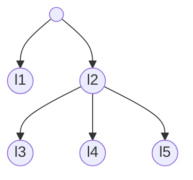

# Tool that estimates models' predictive performance using cross-validation

## Cross-validation

Cross-validation is a resampling procedure used to estimate model's predictive performance on a limited data sample. The procedure takes as inputs a data set and a value of the parameter *n*. Then, it randomly divides examples from the data set into *n* folds of approximately equal size. Finally, it repeats *n* times:
  - Hold *i*th fold as a test set
  - Construct a model from the rest of the folds (training set)
  - Use the model to annotate examples in the test set

### Output

For each ensemble model the cross-validation procedure outputs a **table with confidences**. Rows in the table are examples, columns are labels (from a hierarchical class) and values are probabilities that the labels are associated with the examples. The probabilities indicate how confident the model is in the established associations. The table aggregates examples from *n* test sets.

### Example
Suppose that we have a simple data set with a tree-shaped hierarchical class of five labels connected in the following manner:

The data set has ten examples. Two-fold cross-validation randomly divides examples in two groups of five: (e2, e3, e7, e9, e10) and (e1, e4, e5, e6, e8). The procedure first constructs a model using the baseline algorithm from the first set of examples and uses the model to make prediction for the second. Then it constructs a model from the second set of examples and makes prediction for the first. The resulting table with confidences is:
