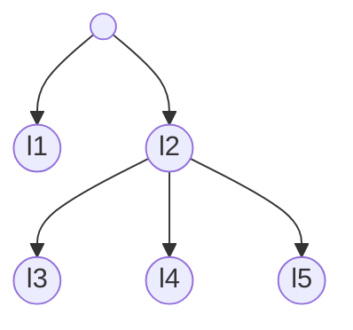

# Tool that estimates models' predictive performance using cross-validation

## Cross-validation

Cross-validation is a resampling procedure used to estimate model's predictive performance on a limited data sample. The procedure takes as inputs a data set and a value of the parameter *n*. Then, it randomly divides examples from the data set into *n* folds of approximately equal size. Finally, it repeats *n* times:
  - Hold *i*<sup>th</sup> fold as a test set
  - Construct a model from the rest of the folds (training set)
  - Use the model to annotate examples in the test set


### Output

For each ensemble model the cross-validation procedure outputs a **table with confidences**. Rows in the table are examples, columns are labels (from a hierarchical class) and values are probabilities that the labels are associated with the examples. The probabilities indicate how confident the model is in the established associations. The table aggregates examples from *n* test sets.

### Example
Suppose that we have a simple data set with a tree-shaped hierarchical class of five labels connected in the following manner:



<br>
The data set has ten examples. Two-fold cross-validation randomly divides examples in two groups of five: (e2, e3, e7, e9, e10) and (e1, e4, e5, e6, e8). The procedure first constructs a model using the baseline algorithm from the first set of examples and uses the model to make prediction for the second. Then it constructs a model from the second set of examples and makes prediction for the first. The resulting table with confidences is:

<table>
    <tr>
        <th rowspan = "2" style="vertical-align: bottom">Example ID</th>
        <th colspan = "5">Labels</th>
    </tr>
    <tr>        
        <th>l1</td>
        <th>l2</th>
        <th>l3</th>
        <th>l4</th>
        <th>l5</th>
    </tr>
    <tr style="text-align: right">
        <td>e1</td> <td>0.12</td> <td>0.87</td> <td>0.05</td> <td>0.61</td> <td>0.79</td>
    </tr>
    <tr style="text-align:right">
        <td>e2</td> <td>0.98</td> <td>0.05</td> <td>0</td> <td>0</td> <td>0.01</td>
    </tr>
    <tr style="text-align:right">
        <td>e3</td> <td>0.02</td> <td>0.59</td> <td>0.05</td> <td>0.24</td> <td>0.59</td>
    </tr>    
    <tr style="text-align:right">
        <td>e4</td> <td>0</td> <td>0.99</td> <td>0.81</td> <td>0.33</td> <td>0.4</td>
    </tr>
    <tr style="text-align:right">
        <td>e5</td> <td>0.31</td> <td>0.55</td> <td>0.12</td> <td>0.05</td> <td>0.01</td>
    </tr>
    <tr style="text-align:right">
        <td>e6</td> <td>0.19</td> <td>0.91</td> <td>0.88</td> <td>0.02</td> <td>0</td>
    </tr>
    <tr style="text-align:right">
        <td>e7</td> <td>0.84</td> <td>0.12</td> <td>0.01</td> <td>0</td> <td>0</td>
    </tr>
    <tr style="text-align:right">
        <td>e8</td> <td>0.14</td> <td>0.74</td> <td>0.09</td> <td>0.71</td> <td>0.73</td>
    </tr>
    <tr style="text-align:right">
        <td>e9</td> <td>0.31</td> <td>0.89</td> <td>0.27</td> <td>0.88</td> <td>0.84</td>
    </tr>
    <tr style="text-align:right">
        <td>e10</td> <td>0.92</td> <td>0.05</td> <td>0</td> <td>0</td> <td>0.01</td>
    </tr>
</table>

The table shows which paths from the hierarchy are more or less likely associated with each of the examples. For example, the baseline model is strongly confident in the association between the example e6 and l2 -> l3 path from the hierarchy (confidence &ge; 0.88).

Note that confidence values for an individual example (within a row) satisfy hierarchy constraint. In other words, confidences for labels do not surpass the confidence of their parent label.

```tip
The pipeline has a separate task that divides examples from an input data set (named baseline data set) into *n* folds. Once the cross-validation folds are created, the pipeline saves the information on which examples are associated with each of the folds. If you want to compare the algorithms on the same cross-validation folds, run this task only once. Then you can run any combination of the algorithms and all of them will be evaluated on the same cross-validation folds.
```


## Measures of model's predictive performance

From the table with confidences the pipeline computes two types of measures of model's predictive performance:
- **Threshold-dependent measures** set a confidence threshold that differentiates between positive and negative associations of labels with examples. The measures are precision, recall, F-measure and accuracy.
- **Threshold-independent measures** summarize predictive performance over a range of confidence thresholds. The measures are AUPRC and AUC.

### Threshold-dependent measures

#### Prediction

Suppose that a model predicts a label *l* for a set of examples. For each example, it will output a confidence. To compute the threshold-dependent measures from the confidences the pipeline follows the steps:
- Set a confidence threshold *t*
- Associate with *l* all the examples with confidence for *l* &ge; *t*
- Associate with not-*l* the rest of the examples

#### Comparison of predicted labels with actual labels

Model's decision to associate *l* or not-*l* with an example may or may not be correct. By making such observations over a set of examples, four outcomes can be recorded for the model and the label *l*:
- **True positives (TP)** are examples for which the model correctly predicts *l*
- **False positives (FP)** are examples for which the model incorrectly predicts *l*
- **True negatives (TN)** are examples for which the model correctly predicts not-*l*
- **False negatives (FN)** are examples for which the model incorrectly predicts not-*l*

The outcomes are summarized in a table named **confusion matrix**:

<table style="text-align:center;">
    <tr>
        <th style = "background: linear-gradient(to top right, white 49.5%, black 49.5%, black 50.5%, white 50.5%); color: black; line-height: 1;"><div style = "margin-left: 2em; text-align: right;">Actual<br>label</div><div style = "margin-right: 2em; text-align: left;">Predicted &#160;</div></th>
        <th><i>l</i></th>
        <th>not-<i>l</i></th>
    </tr>
    <tr>
        <th><i>l</i></th>
        <td>TP</td>
        <td>FP</td>
    </tr>
    <tr>
        <th>not-<i>l</i></th>
        <td>FN</td>
        <td>TN</td>
    </tr>
</table>

#### Measures

From the confusion matrix, the pipeline compute four measures:

- **Accuracy** is a share of examples with correct predictions in all of the examples

$$ \text{accuracy} = \frac{\text{TP + TN}}{\text{TP + FP + TN + FN}} $$

- **Precision** is a share of examples with correctly predicted *l* in the set of examples with predicted *l*

$$ \text{precision} = \frac{\text{TP}}{\text{TP + FP}} $$

- **Recall** is a share of examples with correctly predicted *l* in the set of examples that are actually associated with *l*

$$ \text{recall} = \frac{\text{TP}}{\text{TP + FN}} $$

- **F-measure** is a harmonic mean of precision and recall

$$ \text{F-measure} = \frac{2 \times \text{precision} \times \text{recall}}{\text{precision + recall}} $$

#### Example

The four threshold-dependent measures are computed for the label l5 and threshold 0.5 by following the steps:

1. Prediction: The examples with confidence &ge; 0.5 are associated with l5 and vice versa (the third row in the table):

<table style="text-align: right">
    <tr>
        <th>Example ID</th> <td>e1</td> <td>e2</td> <td>e3</td> <td>e4</td> <td>e5</td> <td>e6</td> <td>e7</td> <td>e8</td> <td>e9</td> <td>e10</td>
    </tr>
    <tr>
        <th>Confidences for l5</th> <td>0.79</td> <td>0.01</td> <td>0.59</td> <td>0.4</td> <td>0.01</td> <td>0</td> <td>0</td> <td>0.73</td> <td>0.84</td> <td>0.01</td>
    </tr>
    <tr>
        <th>Predicted at <i>t</i> = 0.5</th> <td><i class="fa fa-check"></i></td> <td><i class="fa fa-times"></i></td> <td><i class="fa fa-check"></i></td> <td><i class="fa fa-times"></i></td> <td><i class="fa fa-times"></i></td> <td><i class="fa fa-times"></i></td> <td><i class="fa fa-times"></i></td> <td><i class="fa fa-check"></i></td> <td><i class="fa fa-check"></i></td> <td><i class="fa fa-times"></i></td>
    </tr>
    <tr>
        <th>Actual label</th> <td><i class="fa fa-check"></i></td> <td><i class="fa fa-times"></i></td> <td><i class="fa fa-times"></i></td> <td><i class="fa fa-check"></i></td> <td><i class="fa fa-check"></i></td> <td><i class="fa fa-times"></i></td> <td><i class="fa fa-times"></i></td> <td><i class="fa fa-check"></i></td> <td><i class="fa fa-check"></i></td> <td><i class="fa fa-times"></i></td>
    </tr>
</table>

2. Confusion matrix: Computed by comparing predicted (the third row in the table) and actual labels (the fourth row in the table):

<table style="text-align:center;">
    <tr>
        <th style = "background: linear-gradient(to top right, #F8F8FF 49.5%, black 49.5%, black 50.5%, #F8F8FF 50.5%); color: black; line-height: 1;"><div style = "margin-left: 2em; text-align: right;">Actual<br>label</div><div style = "margin-right: 2em; text-align: left;">Predicted &#160;</div></th>
        <th><i>l</i></th>
        <th>not-<i>l</i></th>
    </tr>
    <tr>
        <th><i>l</i></th>
        <td>3</td>
        <td>1</td>
    </tr>
    <tr>
        <th>not-<i>l</i></th>
        <td>2</td>
        <td>4</td>
    </tr>
</table>

3. Measures: Computed from the confusion matrix:
- accuracy = 0.7
- precision = 0.75
- recall = 0.6
- F-measure = 0.67

```tip
The pipeline outputs a confusion matrix and threshold-dependent measures for each label in a data set. They can be outputted for multiple thresholds. You can define the thresholds in a settings file.
```

```warning
Accuracy is not a good measure of model's performance in the case of highly unbalanced labels. An example of a highly unbalanced label is when in 100 examples five are labeled with *l* and 95 as not-*l*. In such case, a model that would always return not-*l* as an answer would have 0.95 accuracy. At the same time it would have zero precision, recall and F-measure. Be aware of unbalanced labels in data sets with large class hierarchy, where the number of positive examples reduce with the depth of hierarchy.
```
