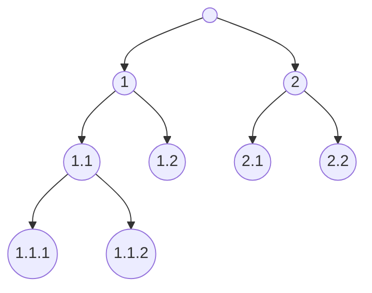

# Tool that computes data set properties

Data set properties can indicate which algorithm has advantage over the others and can help estimate computer resources needed to run the algorithms. The properties are divided in three groups:

1. **General info** includes the number of attributes and examples
2. **Hierarchical class** properties describe size and complexity of a hierarchy
3. **Annotations** related properties indicate the amount of annotations used to estimate algorithm performance in cross-validation.

# General info

- **Examples** - The number of examples in the data set
- **Nominal attributes** can take one of the predefined values. The property indicates the number of such attributes.
- **Numeric attributes** take an integer or real number as a value. The property indicates the number of such attributes.

# Hierarchical class

- **Labels** - The number of labels in hierarchy
- **Leaves** - The number of leaf labels
- **Maximal depth** - The number of labels on the longest path in hierarchy (root excluded)
- **Type** - Hierarchy can be tree-shaped or in the form of directed acyclic graph (DAG). In the former a label can have only one parent, while in the later a label can have multiple parents.
- **Average forward branching factor** - The number of children labels per parent averaged over all parent labels in hierarchy.
- **Average backward branching factor** - The number of parent labels per child averaged over all children labels in hierarchy. Backward branching factor is always one for tree-shaped hierarchies, while it is greater than one for DAG hierarchies.

# Annotations

**Annotation** is an association between a label and an example.

Annotation-related data set properties are best explained with an example. Suppose that we have the following hierarchy:

and a data set composed of five examples annotated in the following manner:

| Example / Label |  1  | 1.1 | 1.1.1 | 1.1.2 | 1.2 |  2  | 2.1 | 2.2 |
| --------------: | :-: | :-: | :---: | :---: | :-: | :-: | :-: | :-: |
| 1               |||||| <i class="fa fa-check"></i> || <i class="fa fa-check"></i> |
| 2               | <i class="fa fa-check"></i> | <i class="fa fa-check"></i> |||||||
| 3               | <i class="fa fa-check"></i> | <i class="fa fa-check"></i> || <i class="fa fa-check"></i> |||||
| 4               | <i class="fa fa-check"></i> | <i class="fa fa-check"></i> | <i class="fa fa-check"></i> || <i class="fa fa-check"></i> ||||
| 5               |||||| <i class="fa fa-check"></i> | <i class="fa fa-check"></i> ||

The number of **most specific labels** is obtained by:
- collecting the most specific annotations for each example, which are:

| Example / Label |  1  | 1.1 | 1.1.1 | 1.1.2 | 1.2 |  2  | 2.1 | 2.2 |
| --------------: | :-: | :-: | :---: | :---: | :-: | :-: | :-: | :-: |
| 1               |||||||| <i class="fa fa-check"></i> |
| 2               || <i class="fa fa-check"></i> |||||||
| 3               |||| <i class="fa fa-check"></i> |||||
| 4               ||| <i class="fa fa-check"></i> || <i class="fa fa-check"></i> ||||
| 5               ||||||| <i class="fa fa-check"></i> ||

- counting the number of distinct labels among the annotations (six labels; all except 1 and 2).

**Cardinality** is an average number of annotations per example.

**Cardinality - complete** indicates the amount of annotations available to the complete hierarchy decomposition algorithms. These algorithms ignore hierarchy over labels. In our example, the algorithms would construct model(s) from the second table. Consequently, they would have 1.2 annotation available per example and would not construct model(s) for labels 1 and 2.

**Cardinality - hierarchical** indicates the amount of annotations available to the hierarchical algorithms (baseline and partial hierarchy decomposition algorithms) when only most specific labels are taken into account. These algorithms construct model(s) from the complete set of labels (the first table). Their performance, however, is evaluated on the set of most specific labels common to the complete decomposition algorithms (six most specific labels). Nevertheless, hierarchical algorithms have access to more annotations (cardinality of 1.6) than the complete decomposition algorithms (cardinality 1.2) simply because they account for hierarchy over labels (the third table).

| Example / Label |  1  | 1.1 | 1.1.1 | 1.1.2 | 1.2 |  2  | 2.1 | 2.2 |
| --------------: | :-: | :-: | :---: | :---: | :-: | :-: | :-: | :-: |
| 1               |||||||| <i class="fa fa-check"></i> |
| 2               || <i class="fa fa-check"></i> |||||||
| 3               || <i class="fa fa-check"></i> || <i class="fa fa-check"></i> |||||
| 4               || <i class="fa fa-check"></i> | <i class="fa fa-check"></i> || <i class="fa fa-check"></i> ||||
| 5               ||||||| <i class="fa fa-check"></i> ||

Annotation-related data set properties may indicate the type of algorithm best suited for a data set. Cases:

- When the number of most specific labels is equal to the number of hierarchy leaves, all paths associated with examples end with a leaf label. In such cases, the complete decomposition algorithms tend to outperform the hierarchical algorithms.
- In addition, when both cardinality values are one, the Label vs. the rest algorithm tend to performs best.
- With an increase in difference between the "Cardinality - hierarchical" and "Cardinality - complete" there is an increase in chance that the hierarchical algorithms will outperform the complete decomposition algorithms.
